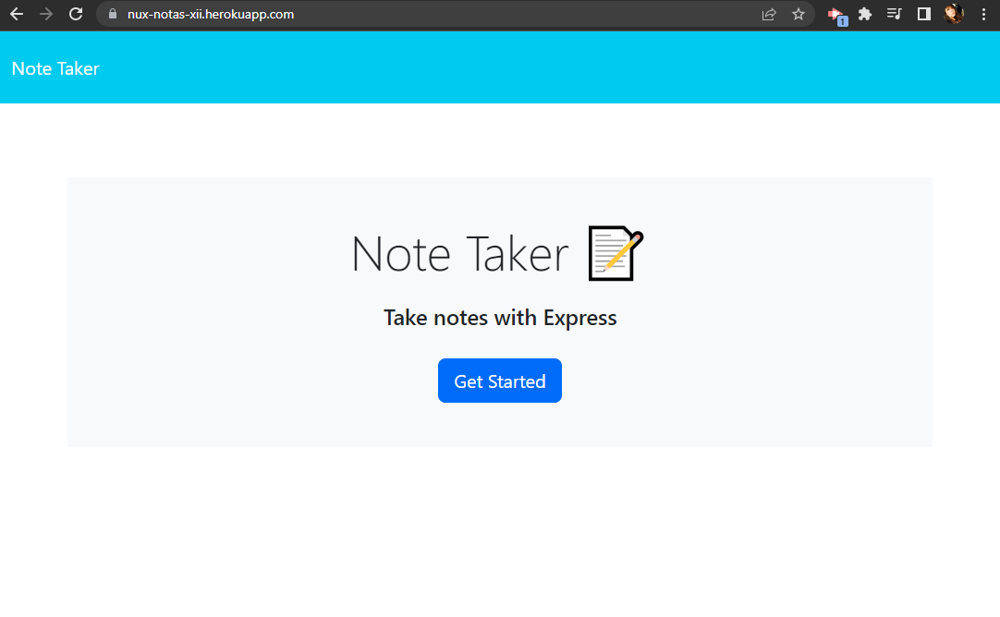

# Nux Notas XII

## URL: https://nux-notas-xii.herokuapp.com/

## Description

A note taker app that utilizes node dependencies such as Express.js, Inquirer, and uuidv4, to create, edit, and delete notes created by the user.

## Installations

N/A - No installation is needed as the dependencies were saved to the deployed app through:

```
npm i --save
```

## Usage

Visit the deployed URL provided at the top of this README to be able to use the app. 

Please follow the listed instructions to use the note taker:

<ol>
<li>Click on the 'GET STARTED' button in the middle of the page, it should redirect you to the notes route</li>
<li>Type in the data required in the Note Title and Note Text Area, you are not able to save and store the note if any of these areas are blank</li>
<li>To create a New Note, you may click on the '+' sign on the upper right of the page or click Save on each note as the page will refresh for the user to be able to add in a new note</li>
<li>Once the notes are saved, the notes will be listed on the left side of the page</li>
<li>To view the note text provided by the user, click on the title of the notes in the list, and the user shall be able to view the full note details</li>
<li>Users shall be able to delete notes when deemed necessary by clicking the trash button beside the listed notes</li>
</ol>

## Screenshot

Below is a screenshot of the deployed note taker app in Heroku.

<ul>

<li>Homepage</li>



<li>Notes Page</li>


<li>Notes sample</li>


</ul>

## Credits

The following programs / guides were used to create this project:

<ul>
<li>Node.js - https://nodejs.org/en/</li>
<li>Inquirer.js - https://www.npmjs.com/package/inquirer</li>
<li>Express.js - https://expressjs.com/</li>
<li>uuidv4 - https://www.npmjs.com/package/uuidv4</li>
</ul>

Thank you to the instructors that helped with this challenge.

## License

N/A


